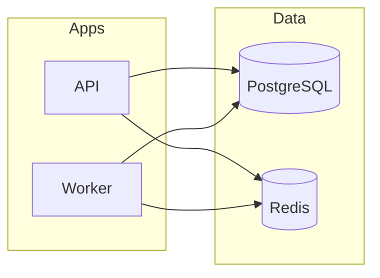

This document describes the architecture of the Selfmade Agent. The application is intended as an easy-to-use AI-Agent service, accessible via a web application (planned) and capable of proactively executing tools for problem-solving. It should also independently evaluate whether additional tools are needed for user requirements, search for them on the web, and install them if necessary. Long story short: the most idiot-friendly AI-Agent deus ex machina service conceivable.

## App Components

The system consists of two applications that run in parallel: the API handles HTTP requests and enqueues jobs; the Worker processes those jobs from the Redis queue. Both share dependencies and connect to PostgreSQL and Redis.

| App | Entry Point | Script | Role |
|-----|-------------|--------|------|
| API | `apps/api/src/server.js` | `pnpm dev` / `pnpm dev:api` | HTTP server (REST API) |
| Worker | `apps/worker/src/runWorker.js` | `pnpm dev:worker` | Background process for queue jobs |

**Shared dependencies:** `bullmq`, `dotenv`, `ioredis`, `openai`, `pg`

## Further Documentation

- [Configuration](configuration.md) – Environment variables, API keys, tool prerequisites
- [Data Flow](data-flow.md) – Request lifecycle from API to Worker
- [API](api.md) – Endpoints, structure, request format
- [Worker](worker.md) – Queue consumer, run processing, state machine, tool calling (web_search, read_webpage)
