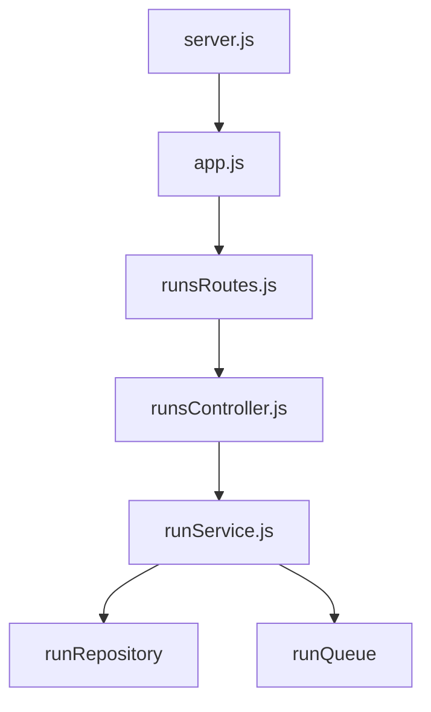

# API

## Overview

The API is a Node.js HTTP server (port configurable via `PORT` env) that accepts run requests, persists them to PostgreSQL, and enqueues jobs in Redis for the Worker.

## Structure



- **server.js** – Bootstrap, HTTP server, `ensureRunsDir`
- **app.js** – Request handler, error mapping (404, 400, 500)
- **runsRoutes.js** – Route dispatch by method + path
- **runsController.js** – Parse body, call service, return JSON
- **runService.js** – Create run, enqueue job

## Endpoints

| Method | Path | Description |
|--------|------|-------------|
| GET | `/health` | Health check |
| POST | `/runs` | Create run, enqueue job |
| GET | `/runs` | List all runs |
| GET | `/runs/:id` | Get run by id |

## Request Format (POST /runs)

JSON body, `Content-Type: application/json`:

```json
{
  "userText": "Your message or question for the agent"
}
```

- `userText` (string, required) – Validated by the Worker; invalid input causes run failure.
