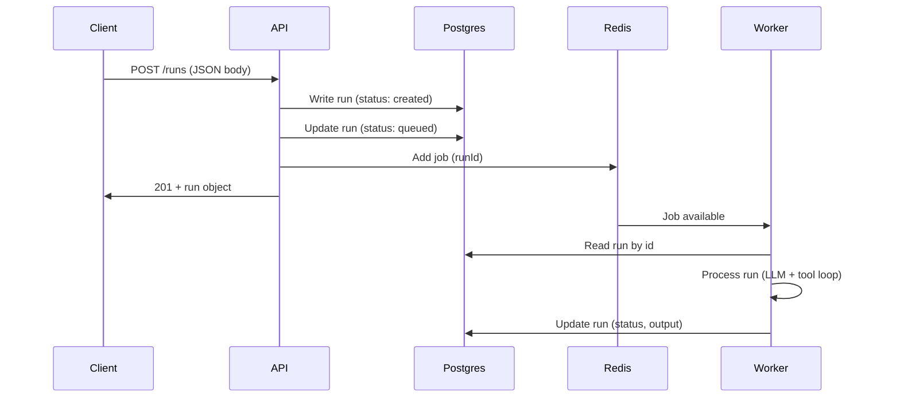
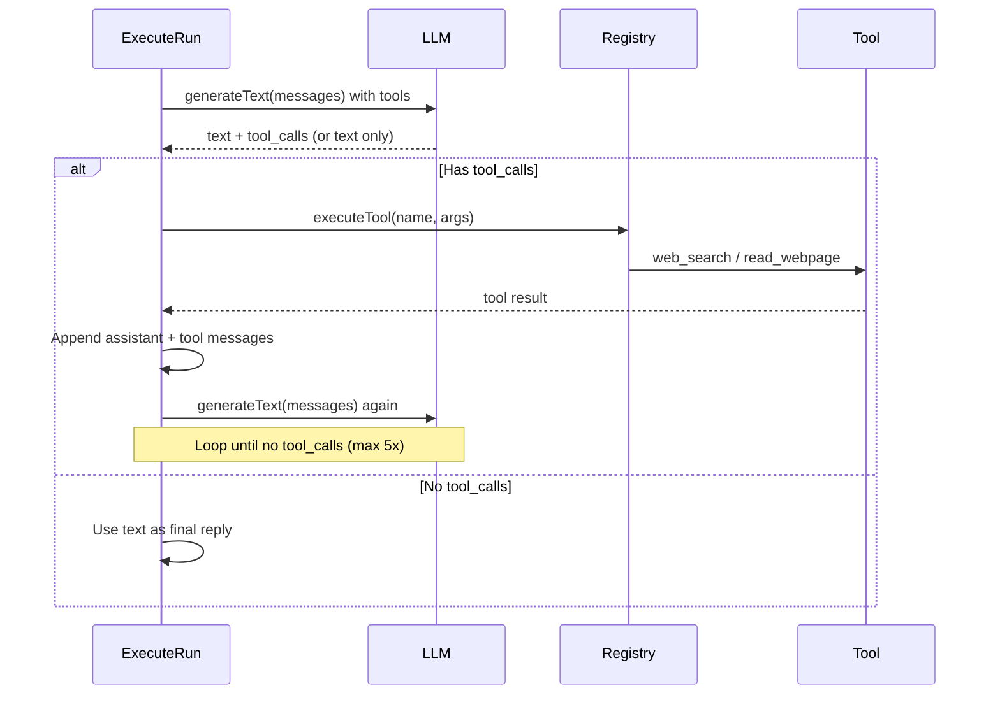

# Data Flow

## Request to Run Processing

The API receives requests synchronously and returns immediately after persisting the run and enqueuing the job. The Worker blocks on Redis (BullMQ) and picks up jobs as soon as they are available; it then processes them asynchronously.

## Tool Loop (inside Worker)

When the LLM model supports tool calling (e.g. OpenRouter with `gpt-4o-mini`), the Worker runs an inner loop:

- **First call:** User prompt + system prompt sent to LLM with `tools: TOOL_SCHEMAS`.
- **If `tool_calls`:** Each tool is executed via `registry.executeTool()`, results are appended as `role: tool` messages, then the LLM is called again with the extended conversation.
- **Loop:** Repeats until the LLM returns a text response without `tool_calls` or until max 5 iterations.
