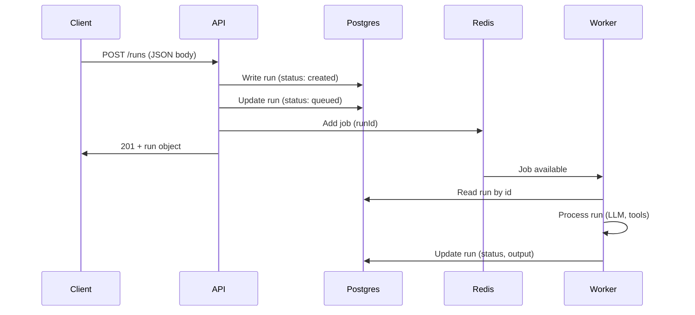

# Data Flow

## Request to Run Processing

The API receives requests synchronously and returns immediately after persisting the run and enqueuing the job. The Worker blocks on Redis (BullMQ) and picks up jobs as soon as they are available; it then processes them asynchronously.
