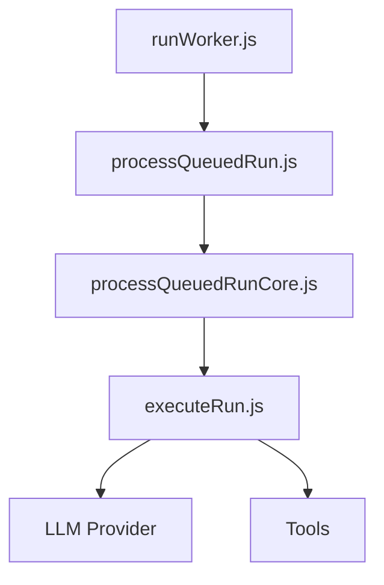
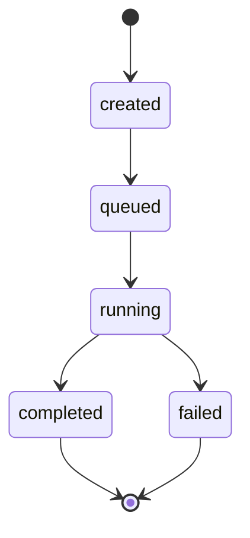

# Worker

## Overview

The Worker is a BullMQ queue consumer that processes run jobs from Redis. It fetches runs from PostgreSQL, executes them (LLM + tools), and persists status updates.

## Structure

- **runWorker.js** – BullMQ Worker, job validation, metrics, shutdown
- **processQueuedRun** – Orchestrates run lifecycle (queued → running → completed/failed)
- **processQueuedRunCore** – State transitions, `executeRun` call, retry handling
- **executeRun** – Validates input, calls LLM, returns result

## Queue

- **Queue name:** `runs` (from `RUNS_QUEUE_NAME`)
- **Job name:** `process-run`
- **Job payload:** `{ runId: string }`
- **Retries:** 3 attempts, exponential backoff (1s base)

## Run State Machine

## LLM & Tools

- **LLM:** OpenRouter or OpenAI (via `LLM_PROVIDER` env)
- **Tools:** `webSearch`, `readWebpage` (see `docs/CAPABILITIES_AND_TOOLS.md`)
