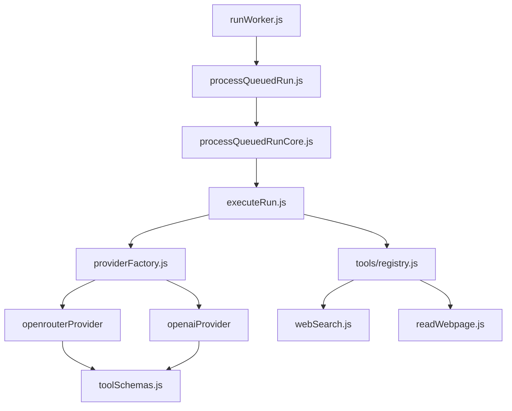
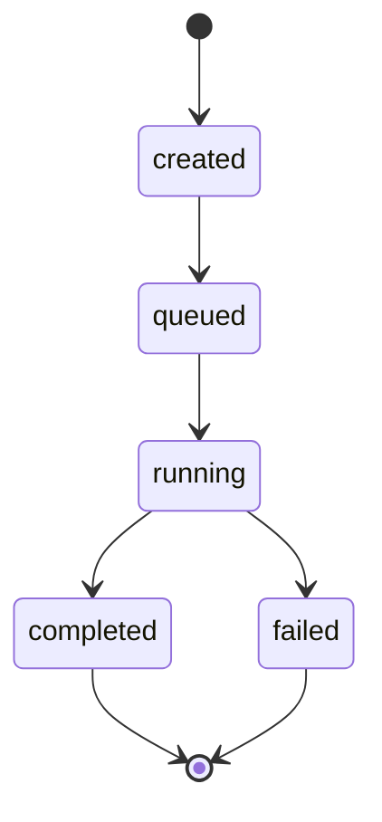

# Worker

## Overview

The Worker is a BullMQ queue consumer that processes run jobs from Redis. It fetches runs from PostgreSQL, executes them via the LLM, and persists status updates.

**Startup:** `pnpm dev:worker` runs `apps/worker/src/runWorker.js`. After env check and Redis connection setup, `startRunWorker()` is called.

## Core: BullMQ Worker

The heart of the Worker is the BullMQ `Worker` construction: a Redis-connected consumer with a processor callback. When a job is added to the queue, Redis delivers it to the blocking connection; the callback runs with the job and calls `processQueuedRun(runId, options)`.

## Structure

- **runWorker.js** – BullMQ Worker, job validation, metrics, shutdown handlers
- **processQueuedRun** – Function returned by factory (`createProcessQueuedRun`); created once with injected deps, called per job
- **processQueuedRunCore** – Orchestrates run lifecycle (queued → running → completed/failed), calls `executeRun`, handles retries
- **executeRun** – Agent heart: validates `input.userText`, builds messages, runs tool-calling loop, returns result
- **providerFactory.js** – Resolves LLM provider (OpenRouter or OpenAI) from `LLM_PROVIDER` env
- **tools/registry.js** – Maps tool names (`web_search`, `read_webpage`) to execute functions
- **toolSchemas.js** – Defines `TOOL_SCHEMAS` in OpenAI format for API requests

## Queue

- **Queue name:** `runs` (from `RUNS_QUEUE_NAME`)
- **Job name:** `process-run`
- **Job payload:** `{ runId: string }`
- **Retries:** 3 attempts, exponential backoff (1s base)

## Run State Machine

## LLM & Tools

- **LLM:** OpenRouter or OpenAI (via `LLM_PROVIDER` env). `executeRun` builds a messages array and calls `llmProvider.generateText(messages)`.
- **Tool-calling flow:** executeRun sends the initial user prompt with `TOOL_SCHEMAS`; when the model returns `tool_calls`, the registry executes the requested tools (`web_search`, `read_webpage`), appends tool results to the conversation, and calls the LLM again. Loop continues until no more `tool_calls` (max 5 iterations). OpenRouter supports this natively; OpenAI returns text only (no tools).
- **Tools:** `web_search` (Serper API, `SERPER_API_KEY`) and `read_webpage` (Cheerio) are wired via `registry.js` and `toolSchemas.js`. New tools: add to both files + diagram (`registry --> newTool`).
