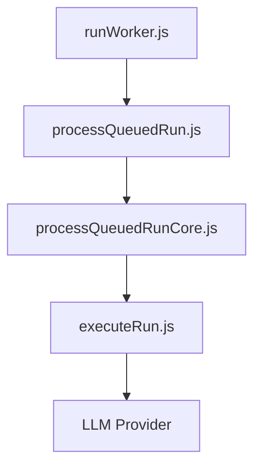
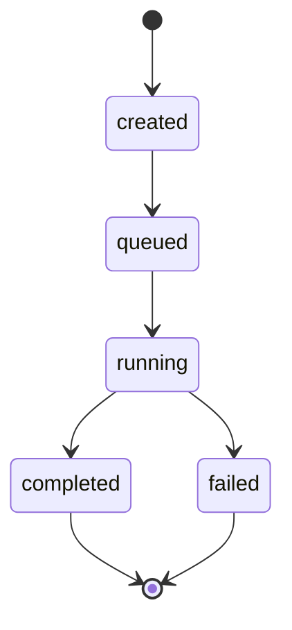

# Worker

## Overview

The Worker is a BullMQ queue consumer that processes run jobs from Redis. It fetches runs from PostgreSQL, executes them via the LLM, and persists status updates.

**Startup:** `pnpm dev:worker` runs `apps/worker/src/runWorker.js`. After env check and Redis connection setup, `startRunWorker()` is called.

## Core: BullMQ Worker

The heart of the Worker is the BullMQ `Worker` construction: a Redis-connected consumer with a processor callback. When a job is added to the queue, Redis delivers it to the blocking connection; the callback runs with the job and calls `processQueuedRun(runId, options)`.

## Structure

- **runWorker.js** – BullMQ Worker, job validation, metrics, shutdown handlers
- **processQueuedRun** – Function returned by factory (`createProcessQueuedRun`); created once with injected deps, called per job
- **processQueuedRunCore** – Orchestrates run lifecycle (queued → running → completed/failed), calls `executeRun`, handles retries
- **executeRun** – Agent heart: validates `input.userText`, calls LLM, returns result

## Queue

- **Queue name:** `runs` (from `RUNS_QUEUE_NAME`)
- **Job name:** `process-run`
- **Job payload:** `{ runId: string }`
- **Retries:** 3 attempts, exponential backoff (1s base)

## Run State Machine

## LLM & Tools

- **LLM:** OpenRouter or OpenAI (via `LLM_PROVIDER` env). `executeRun` passes `input.userText` to `llmProvider.generateText()`.
- **Current flow:** Simple prompt → LLM → response. No tool-calling loop.
- **Tools:** `webSearch`, `readWebpage` exist as modules but are **not wired in**; they are not called from `executeRun`. Tool calling is planned but not yet implemented.
